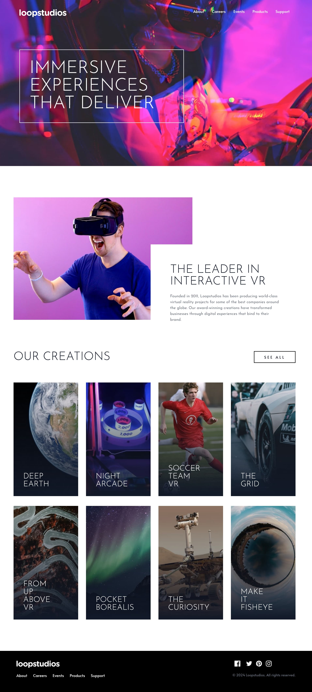

# Frontend Mentor - Loopstudios landing page solution

This is a solution to the [Loopstudios landing page challenge on Frontend Mentor](https://www.frontendmentor.io/challenges/loopstudios-landing-page-N88J5Onjw). Frontend Mentor challenges help you improve your coding skills by building realistic projects. 

## Table of contents

- [Overview](#overview)
  - [The challenge](#the-challenge)
  - [Screenshot](#screenshot)
  - [Links](#links)
- [My process](#my-process)
  - [Built with](#built-with)
  - [What I learned](#what-i-learned)
  - [Useful resources](#useful-resources)
- [Author](#author)
- [Acknowledgments](#acknowledgments)

## Overview

### The challenge

Users should be able to:

- View the optimal layout for the site depending on their device's screen size
- See hover states for all interactive elements on the page

### Screenshot




### Links

- [Solution URL](https://www.frontendmentor.io/solutions/responsive-landing-page-using-tailwind-css-jPm9zuCn1O)
- [Live Site URL](https://loopstudios-landing-page-psi-pearl.vercel.app/)

## My process

### Built with

- Semantic HTML5 markup
- Flexbox
- [Tailwind CSS](https://tailwindcss.com/)


### What I learned

Honestly, outside of some obscure tutorial, this is probably the first time I've ever used the window.matchMedia() method. Setting it up here along with the 'inert' attribute was an interesting approach that came out of Jessica Chan's YouTube tutorial (see below) and worked great for the problem of auto-closing an open mobile nav when switching to a wider screen.
```js
const media = window.matchMedia('(width < 48em)');

function setupTopNav(e) {
  if (e.matches) {
    // is mobile
    topNavMenu.setAttribute('inert', '');
    topNavMenu.style.transition = 'none';
  } else {
    // is tablet/desktop
    closeMobileMenu();
    topNavMenu.removeAttribute('inert');
  }
}

media.addEventListener('change', function (e) {
  setupTopNav(e);
});
```

### Useful resources

- [Coder Coder](https://youtu.be/pBv7igaxfQE) - Jessica Chan recently published an excellent tutorial on building an accessible hamburger menu. This video helped me tremendously in adapting my original nav menu to something that incorporates more accessibility features and generally just works better. She's using SCSS in this video, but I chose to simply add the necessary vanilla CSS and JS with this project, incorporating my existing Tailwind code. I'd imagine I'll keep coming back to this navigation code frequently to build better navs for other projects.

## Author

- Website - [mattpahuta.com](https://www.mattpahuta.com)
- LinkedIn - [LinkedIn](www.linkedin.com/in/mattpahuta)
- Frontend Mentor - [@mattpahuta](https://www.frontendmentor.io/profile/MattPahuta)


## Acknowledgments

- [Brad Traversy](https://www.traversymedia.com/) - I completed this challenge after working through Brad Traversy's excellent [Tailwind from Scratch](https://tailwindfromscratch.com/) course, making some additional alterations along the way, particularly with the desktop/mobile navigation (see below) and semantic HTML. But Brad's course is excellent and provides everything I needed in order to get off the ground and using Tailwind more confidently.
- [Coder Coder](https://coder-coder.com/) - Again, a big thanks to Jessica's excellent video on building a semantically correct navigation menu. She's an excellent resource to all things CSS, SCSS, JS, and more. 
